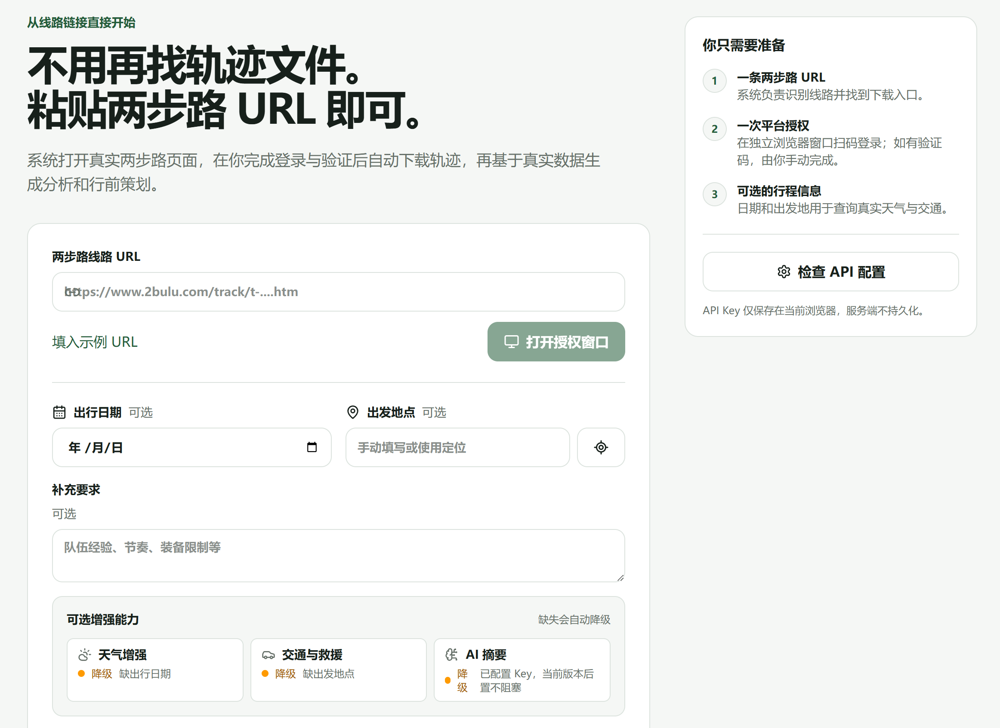
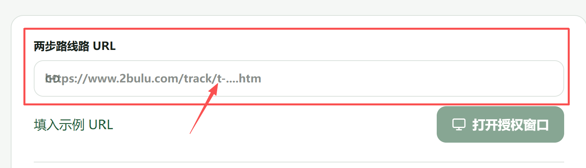
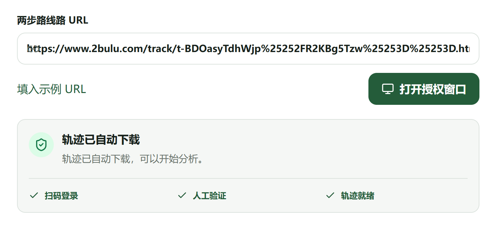
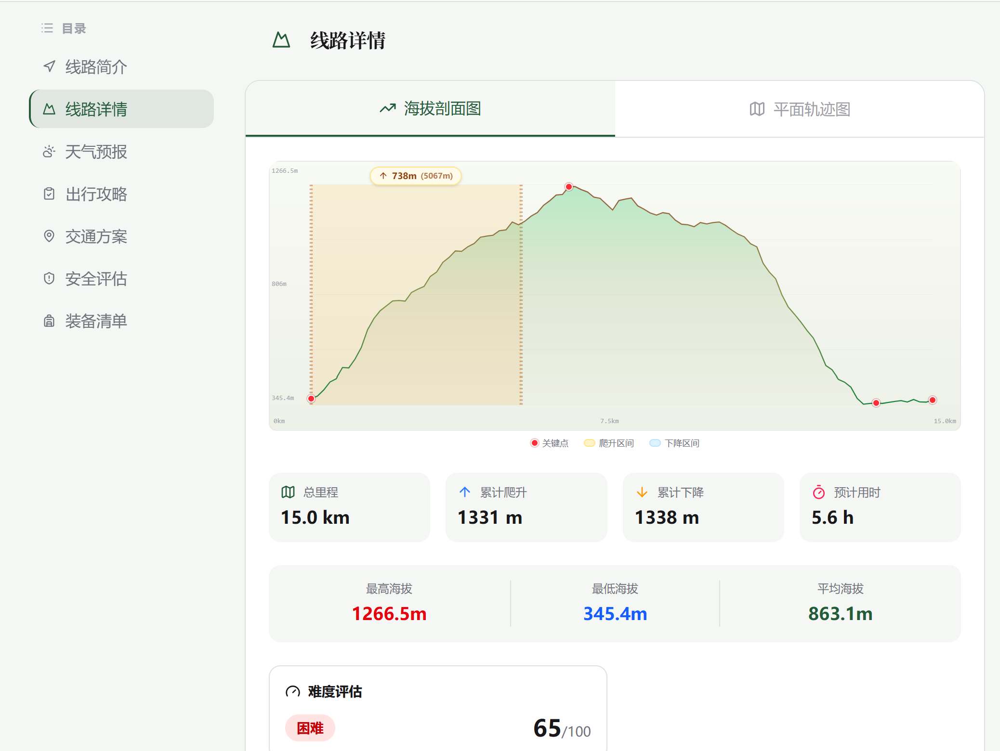
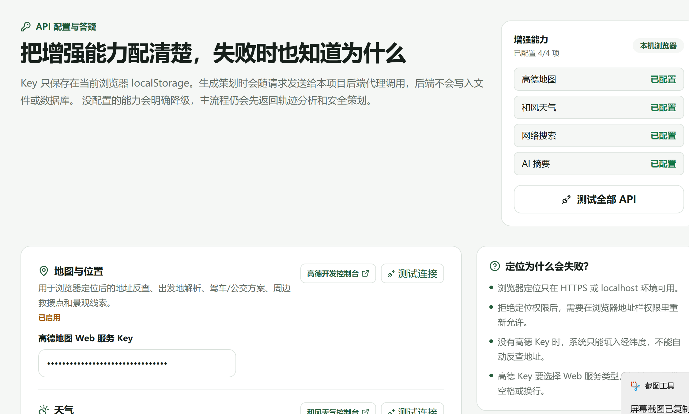

# 户外策划（szhuwai）

> 粘贴一条两步路线路链接，几分钟拿到一份**基于真实轨迹**的户外活动策划书——可一键导出 PDF 或长图。

面向户外领队、学生社团和户外爱好者。做活动前要写策划书：拉轨迹、量距离爬升、查天气、排交通、估难度耗时，全靠手填既慢又容易出错；丢给通用 AI 又常常编造不存在的路线和数据。本项目用**真实下载的轨迹文件**生成分析，缺数据时宁可只出轨迹分析，也不捏造天气和交通。


## 为什么用它

- **真实轨迹，不靠 AI 瞎编**：直接从两步路下载真实的 KML/GPX，距离、爬升、海拔都来自实际轨迹，不是模型生成的。

### 上传后

- **一键产出可用的策划书**：自动算出距离、累计爬升、难度等级、预计耗时，并可导出 PDF / 长图，直接用于汇报或分享。

- **缺信息就不写，绝不糊弄**：没填出行日期或出发地时，只生成轨迹分析，不会编造天气和交通。
- **你的密钥只属于你**：天气、地图、搜索、大模型 API Key 都保存在你自己的浏览器里，后端不存储、不上传。


## 三步上手

1. **粘贴链接**：把两步路线路的 URL 粘进来。
2. **扫码授权**：扫码登录两步路，按平台提示完成验证码。
3. **拿到策划书**：几秒钟内生成带轨迹分析的策划书，可按需补充天气/交通，并导出 PDF 或长图。

## 核心功能

- 粘贴两步路线路 URL，自动解析并拉起本机浏览器完成授权登录。
- 基于真实轨迹分析：距离、累计爬升、海拔、难度等级、预计耗时。
- 按需补充天气与交通：填写出行日期和出发地后自动接入；浏览器定位可辅助填写出发地。
- 策划书导出：PDF（浏览器原生打印，另存为 PDF）或长图 PNG。
- 生成过程实时可见：SSE 进度推送，每一步都看得到。
- 隐私优先：所有第三方 API Key 仅存于当前浏览器，后端不持久化。

## 本地运行

### 方式一：让 AI 帮你装（推荐）

把下面这段话发给任意 Agent（Workbuddy、Trae、Qoder、Claude Code、Codex、Hermes、Openclaw 等）：

```
前往 https://github.com/porridgeowefish/szhuwai，克隆仓库后，按照 README 帮我配置好运行环境，并告诉我如何运行和使用（用通俗的语言）。
```

### 方式二：手动部署

后端：

```bash
cd backend
pip install -r requirements.txt
python main.py
```

前端：

```bash
cd frontend
npm install
npm run dev
```

浏览器打开 `http://localhost:3000`，后端 API 文档位于 `http://localhost:8000/docs`。

> **环境要求**：两步路轨迹授权依赖本机可见的 Chrome 或 Edge。Docker 容器内没有桌面浏览器时，其他接口仍可运行，但无法完成两步路授权下载——此时页面会给出明确提示。可用环境变量 `TWO_BULU_BROWSER_PATH` 指定浏览器路径。

## 工作原理（给开发者）

1. 解析两步路 URL 中的 `trackId`（支持多层 URL 编码）。
2. 拉起独立的 Chrome/Edge 授权窗口，保留两步路登录状态。
3. 登录后自动进入下载流程，监听浏览器真实产生的 KML/GPX 文件。
4. 对轨迹做距离、爬升、海拔、难度和预计时长分析。
5. 按需接入天气、交通信息，并通过 SSE 向前端推送实时进度。

架构示意见 `backend/docs/`（组件图、Agent 状态机、规划状态图）。

## 验证

```bash
make test    # 单元测试
make lint    # ruff + mypy --strict
make build   # 构建产物
```

## 技术栈

- **后端**：FastAPI + Python 3.10+
- **前端**：React + TypeScript + Vite + Tailwind CSS
- **部署**：Docker + Docker Compose

## 两步路访问边界（重要）

> 本项目**不会**识别、绕过或代替用户完成两步路验证码，也**不会**规避 WAF 或访问控制。线路二维码只用于打开线路，并不是授权凭证。只有浏览器真实产生 KML/GPX 文件后，状态才会变为"轨迹就绪"。
