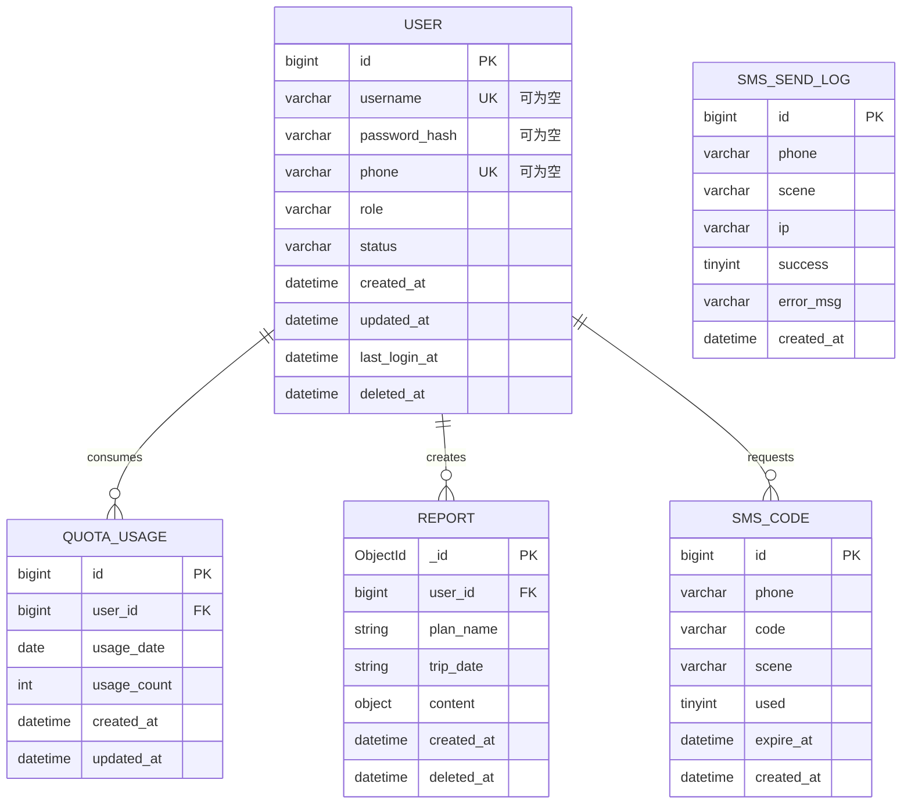
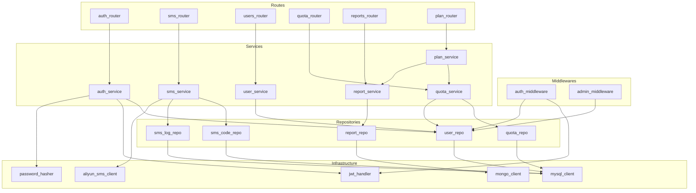

# 户外活动智能规划系统 - 迭代规划文档

> 文档版本: v2.0
> 创建日期: 2026-03-20
> 更新日期: 2026-03-20
> 迭代目标: 用户系统 + 鉴权 + 数据持久化 + 额度限制 + 手机短信认证

---

## 目录

1. [项目概述](#1-项目概述)
2. [需求规格](#2-需求规格)
3. [API 契约](#3-api-契约)
4. [数据库设计](#4-数据库设计)
5. [模块设计](#5-模块设计)
6. [开发计划](#6-开发计划)

---

## 1. 项目概述

### 1.1 迭代目标

将户外活动智能规划系统从**单机工具**升级为**多用户 SaaS 服务**，支持多种认证方式。

### 1.2 核心功能

| 功能 | 描述 |
|------|------|
| 用户注册/登录 | 用户名+密码 或 手机号+验证码 |
| 角色鉴权 | super 管理员 + 普通用户 |
| 报告持久化 | 用户生成的报告保存到数据库 |
| 额度限制 | 每人每天 2 次，0 点重置 |
| 手机短信认证 | 手机号注册、登录、绑定、找回密码 |

### 1.3 技术选型

| 层级 | 技术 |
|------|------|
| 后端框架 | FastAPI + Python 3.10+ |
| 关系型数据库 | MySQL 8.0（用户/额度/验证码） |
| 文档数据库 | MongoDB 7.0（报告 JSON） |
| 缓存（可选） | Redis 7.0（验证码缓存/频率限制） |
| 认证方案 | JWT Bearer Token |
| 密码加密 | bcrypt |
| 短信服务 | 阿里云短信 |

---

## 2. 需求规格

### 2.1 功能清单

#### Must Have（必须有）

| ID | 功能名 | 描述 | 用户故事 |
|----|--------|------|----------|
| F001 | 用户名注册 | 用户名+密码注册 | 作为新用户，我想用用户名注册账号 |
| F002 | 用户名登录 | 用户名+密码登录 | 作为用户，我想用用户名密码登录 |
| F003 | 额度限制 | 每人每天 2 次，0点重置 | 作为管理员，我想控制用户使用频率 |
| F004 | 报告保存 | 生成后自动存入 MongoDB | 作为用户，我想保存生成的报告以便后续查看 |
| F005 | 报告列表 | 查看自己的历史报告 | 作为用户，我想查看我生成的所有报告 |
| F006 | 报告删除 | 用户可删除自己的报告 | 作为用户，我想删除不需要的报告 |
| F007 | 鉴权中间件 | API 级别的权限控制 | 作为系统，我需要验证请求者的身份和权限 |
| F008 | 手机号注册 | 手机号+短信验证码注册 | 作为新用户，我想用手机号快速注册 |
| F009 | 手机号登录 | 手机号+短信验证码登录 | 作为用户，我想用手机验证码登录，无需记密码 |
| F010 | 手机绑定 | 已注册用户绑定手机号 | 作为用户，我想给我的账号绑定手机 |
| F011 | 短信找回密码 | 通过手机验证码重置密码 | 作为用户，我忘记密码时想通过手机重置 |

#### Should Have（应该有）

| ID | 功能名 | 描述 |
|----|--------|------|
| F012 | 用户管理界面 | 管理员查看/禁用用户 |
| F013 | 额度查询 | 用户可查看今日剩余额度 |
| F014 | 解绑手机 | 用户可解绑已绑定的手机号 |

#### Won't Have（暂不考虑）

- 微信登录、第三方 OAuth
- 报告分享/公开链接
- 付费套餐

### 2.2 角色权限

| 角色 | 权限范围 | 额度 |
|------|----------|------|
| admin (super 管理员) | 全部权限 + 用户管理 | 无限制 |
| user (普通用户) | 仅操作自己的数据 | 每日 2 次 |

### 2.3 认证方式对比

| 认证方式 | 适用场景 | 状态 |
|----------|----------|------|
| 用户名+密码 | 超级管理员登录、传统用户 | ✓ 支持 |
| 手机号+验证码 | 普通用户快速登录 | ✓ 支持 |
| 手机号+密码 | 可选扩展 | ✗ 暂不支持 |

### 2.4 业务流程

#### 2.4.1 用户名注册流程

```
用户输入用户名 → 检查用户名是否存在 → 输入密码 → 注册成功
```

#### 2.4.2 手机号注册流程

```
用户输入手机号 → 发送验证码 → 用户输入验证码 → 验证通过 → 设置密码（可选）→ 注册成功
```

#### 2.4.3 手机号登录流程

```
用户输入手机号 → 发送验证码 → 用户输入验证码 → 验证通过 → 返回 JWT Token
```

#### 2.4.4 手机绑定流程

```
已登录用户 → 输入手机号 → 发送验证码 → 输入验证码 → 验证通过 → 绑定成功
```

#### 2.4.5 找回密码流程

```
用户输入手机号 → 发送验证码 → 输入验证码 → 验证通过 → 设置新密码 → 重置成功
```

### 2.5 短信验证码规则

| 规则 | 说明 |
|------|------|
| 验证码长度 | 6 位数字 |
| 验证码有效期 | 5 分钟 |
| 发送频率限制 | 同一手机号 60 秒内只能发送 1 次 |
| 每日发送上限 | 同一手机号每天最多 10 次 |
| 手机号唯一性 | 一个手机号只能绑定一个账号 |
| 密码可选 | 手机注册时密码可设为可选 |

### 2.6 非功能性需求

| 类型 | 要求 |
|------|------|
| 安全 | 密码 bcrypt 加密，JWT token 认证，验证码防爆破 |
| 存储 | MySQL 存用户/额度/验证码，MongoDB 存报告 JSON |
| 部署 | 更新 docker-compose.yml 集成数据库 |
| 短信 | 阿里云短信服务，支持多种模板 |

---

## 3. API 契约

### 3.1 API 概述

- **Base URL**: `/api/v1`
- **认证方式**: JWT Bearer Token（Header: `Authorization: Bearer <token>`）
- **响应格式**: JSON

### 3.2 统一响应格式

**成功**:
```json
{
  "code": 200,
  "message": "success",
  "data": { ... }
}
```

**失败**:
```json
{
  "code": 400001,
  "message": "参数错误",
  "data": null
}
```

### 3.3 接口列表

| 模块 | 方法 | 路径 | 描述 | 认证 |
|------|------|------|------|------|
| **认证-用户名** | POST | /auth/register | 用户名注册 | ✗ |
| | POST | /auth/login | 用户名登录 | ✗ |
| | GET | /auth/me | 获取当前用户信息 | ✓ |
| **认证-手机号** | POST | /auth/sms/send | 发送短信验证码 | ✗ |
| | POST | /auth/sms/register | 手机号注册 | ✗ |
| | POST | /auth/sms/login | 手机号验证码登录 | ✗ |
| **密码管理** | POST | /auth/password/reset | 通过手机重置密码 | ✗ |
| **手机管理** | POST | /auth/phone/bind | 绑定手机号 | ✓ |
| | POST | /auth/phone/unbind | 解绑手机号 | ✓ |
| **用户管理** | GET | /users | 用户列表（管理员） | ✓ Admin |
| | PATCH | /users/{id}/status | 禁用/启用用户 | ✓ Admin |
| **额度** | GET | /quota | 今日剩余额度 | ✓ |
| **报告** | GET | /reports | 我的报告列表 | ✓ |
| | GET | /reports/{id} | 报告详情 | ✓ |
| | DELETE | /reports/{id} | 删除报告 | ✓ |
| **规划** | POST | /generate-plan | 生成计划（改造） | ✓ |

1. **TASK-005 → TASK-009, TASK-018**: UserRepository 接口
2. **TASK-008 → TASK-009**: SmsService 接口
3. **TASK-003 → TASK-009, TASK-011, TASK-019**: JWTHandler 接口
4. **TASK-009 → TASK-010**: AuthService 接口
5. **TASK-014 → TASK-017, TASK-019**: QuotaService 接口
6. **TASK-016 → TASK-017, TASK-019**: ReportService 接口
7. **TASK-011 → TASK-018, TASK-019**: CurrentUser/AdminUser 依赖

### 3.4 接口详情

#### 3.4.1 POST /auth/register（用户名注册）

**请求体**:
```json
{
  "username": "string // 3-20字符，字母开头",
  "password": "string // 6-32字符"
}
```

**成功响应** (201):
```json
{
  "code": 200,
  "message": "注册成功",
  "data": {
    "id": 1,
    "username": "hiker001",
    "phone": null,
    "role": "user",
    "createdAt": "2026-03-20T10:00:00Z"
  }
}
```

**错误**: 400001 参数错误, 409001 用户名已存在

---

#### 3.4.2 POST /auth/login（用户名登录）

**请求体**:
```json
{
  "username": "string",
  "password": "string"
}
```

**成功响应** (200):
```json
{
  "code": 200,
  "message": "登录成功",
  "data": {
    "accessToken": "eyJhbGciOiJIUzI1NiIs...",
    "tokenType": "Bearer",
    "expiresIn": 86400,
    "user": {
      "id": 1,
      "username": "hiker001",
      "phone": "138****1234",
      "role": "user"
    }
  }
}
```

**错误**: 401001 用户名或密码错误, 403001 账号已被禁用

---

#### 3.4.3 GET /auth/me

**认证**: ✓ 需要

**成功响应** (200):
```json
{
  "code": 200,
  "message": "success",
  "data": {
    "id": 1,
    "username": "hiker001",
    "phone": "138****1234",
    "phoneBound": true,
    "role": "user",
    "status": "active",
    "createdAt": "2026-03-20T10:00:00Z"
  }
}
```

---

#### 3.4.4 POST /auth/sms/send（发送验证码）

**请求体**:
```json
{
  "phone": "string // 11位手机号",
  "scene": "string // register|login|bind|reset_password"
}
```

**成功响应** (200):
```json
{
  "code": 200,
  "message": "验证码已发送",
  "data": {
    "expireIn": 300,
    "cooldown": 60
  }
}
```

**错误**: 400001 参数错误, 400003 手机号格式错误, 429001 发送过于频繁, 429002 今日发送次数超限, 500002 短信发送失败

---

#### 3.4.5 POST /auth/sms/register（手机号注册）

**请求体**:
```json
{
  "phone": "string // 11位手机号",
  "code": "string // 6位验证码",
  "password": "string // 可选，6-32字符",
  "username": "string // 可选，3-20字符"
}
```

**成功响应** (201):
```json
{
  "code": 200,
  "message": "注册成功",
  "data": {
    "id": 1,
    "phone": "138****1234",
    "username": null,
    "role": "user",
    "createdAt": "2026-03-20T10:00:00Z"
  }
}
```

**错误**: 400001 参数错误, 400002 验证码错误, 409001 用户名已存在, 409002 手机号已注册

---

#### 3.4.6 POST /auth/sms/login（手机号登录）

**请求体**:
```json
{
  "phone": "string // 11位手机号",
  "code": "string // 6位验证码"
}
```

**成功响应** (200):
```json
{
  "code": 200,
  "message": "登录成功",
  "data": {
    "accessToken": "eyJhbGciOiJIUzI1NiIs...",
    "tokenType": "Bearer",
    "expiresIn": 86400,
    "user": {
      "id": 1,
      "phone": "138****1234",
      "username": "hiker001",
      "role": "user"
    }
  }
}
```

**错误**: 400001 参数错误, 400002 验证码错误, 404002 手机号未注册, 403001 账号已被禁用

---

#### 3.4.7 POST /auth/password/reset（重置密码）

**请求体**:
```json
{
  "phone": "string // 11位手机号",
  "code": "string // 6位验证码",
  "newPassword": "string // 6-32字符"
}
```

**成功响应** (200):
```json
{
  "code": 200,
  "message": "密码重置成功",
  "data": null
}
```

**错误**: 400001 参数错误, 400002 验证码错误, 404002 手机号未注册

---

#### 3.4.8 POST /auth/phone/bind（绑定手机）

**认证**: ✓ 需要

**请求体**:
```json
{
  "phone": "string // 11位手机号",
  "code": "string // 6位验证码"
}
```

**成功响应** (200):
```json
{
  "code": 200,
  "message": "绑定成功",
  "data": {
    "id": 1,
    "phone": "138****1234"
  }
}
```

**错误**: 400001 参数错误, 400002 验证码错误, 409002 手机号已被其他账号绑定

---

#### 3.4.9 POST /auth/phone/unbind（解绑手机）

**认证**: ✓ 需要

**请求体**:
```json
{
  "code": "string // 6位验证码（发送到已绑定手机）"
}
```

**成功响应** (200):
```json
{
  "code": 200,
  "message": "解绑成功",
  "data": { "id": 1, "phone": null }
}
```

**错误**: 400001 参数错误, 400002 验证码错误, 400004 手机号未绑定

---

#### 3.4.10 GET /users

**认证**: ✓ 需要 Admin

**查询参数**: `page`, `pageSize`

**成功响应** (200):
```json
{
  "code": 200,
  "message": "success",
  "data": {
    "list": [
      {
        "id": 1,
        "username": "hiker001",
        "phone": "138****1234",
        "role": "user",
        "status": "active",
        "createdAt": "2026-03-20T10:00:00Z",
        "lastLoginAt": "2026-03-20T12:00:00Z"
      }
    ],
    "pagination": {
      "page": 1,
      "pageSize": 20,
      "total": 50,
      "totalPages": 3
    }
  }
}
```

---

#### 3.4.11 PATCH /users/{id}/status

**认证**: ✓ 需要 Admin

**请求体**:
```json
{
  "status": "string // active 或 disabled"
}
```

**成功响应** (200):
```json
{
  "code": 200,
  "message": "状态更新成功",
  "data": { "id": 1, "status": "disabled" }
}
```

---

#### 3.4.12 GET /quota

**认证**: ✓ 需要

**成功响应** (200):
```json
{
  "code": 200,
  "message": "success",
  "data": {
    "used": 1,
    "total": 2,
    "remaining": 1,
    "resetAt": "2026-03-21T00:00:00Z"
  }
}
```

> 管理员返回 `"remaining": -1` 表示无限制

---

#### 3.4.13 GET /reports

**认证**: ✓ 需要

**查询参数**: `page`, `pageSize`

**成功响应** (200):
```json
{
  "code": 200,
  "message": "success",
  "data": {
    "list": [
      {
        "id": "680c1b2f1234567890abcdef",
        "planName": "三洲田穿越",
        "tripDate": "2026-03-21",
        "overallRating": "推荐",
        "createdAt": "2026-03-20T10:00:00Z"
      }
    ],
    "pagination": { "page": 1, "pageSize": 20, "total": 5, "totalPages": 1 }
  }
}
```

---

#### 3.4.14 GET /reports/{id}

**认证**: ✓ 需要

**成功响应** (200):
```json
{
  "code": 200,
  "message": "success",
  "data": {
    "id": "680c1b2f1234567890abcdef",
    "userId": 1,
    "planName": "三洲田穿越",
    "tripDate": "2026-03-21",
    "content": { ... },
    "createdAt": "2026-03-20T10:00:00Z"
  }
}
```

> `content` 字段为完整的 `OutdoorActivityPlan` JSON

**错误**: 404001 报告不存在, 403002 无权访问此报告

---

#### 3.4.15 DELETE /reports/{id}

**认证**: ✓ 需要

**成功响应** (200):
```json
{
  "code": 200,
  "message": "删除成功",
  "data": null
}
```

---

#### 3.4.16 POST /generate-plan（改造）

**认证**: ✓ 需要

**请求**: 保持原有 FormData 不变

**新增错误**: 401001 未登录, 403003 今日额度已用完

### 3.5 错误码表

| 错误码 | HTTP状态 | 说明 |
|--------|----------|------|
| 400001 | 400 | 参数格式错误 |
| 400002 | 400 | 验证码错误或已过期 |
| 400003 | 400 | 手机号格式错误 |
| 400004 | 400 | 手机号未绑定 |
| 401001 | 401 | 未登录或 Token 无效 |
| 403001 | 403 | 账号已被禁用 |
| 403002 | 403 | 无权访问此资源 |
| 403003 | 403 | 今日额度已用完 |
| 404001 | 404 | 资源不存在 |
| 404002 | 404 | 手机号未注册 |
| 409001 | 409 | 用户名已存在 |
| 409002 | 409 | 手机号已被注册/绑定 |
| 429001 | 429 | 发送过于频繁，请稍后再试 |
| 429002 | 429 | 今日发送次数已达上限 |
| 500001 | 500 | 服务器内部错误 |
| 500002 | 500 | 短信发送失败 |

---

## 4. 数据库设计

### 4.1 ER 图



### 4.2 MySQL 表结构

#### 4.2.1 users（用户表）

| 字段 | 类型 | 约束 | 说明 |
|------|------|------|------|
| id | BIGINT | PK, AUTO_INCREMENT | 主键 |
| username | VARCHAR(50) | NULL, UNIQUE | 用户名（可为空） |
| phone | VARCHAR(20) | NULL, UNIQUE | 手机号（可为空） |
| password_hash | VARCHAR(255) | NULL | bcrypt 加密的密码（可为空） |
| role | VARCHAR(20) | NOT NULL, DEFAULT 'user' | 角色：admin, user |
| status | VARCHAR(20) | NOT NULL, DEFAULT 'active' | 状态：active, disabled |
| created_at | DATETIME | NOT NULL, DEFAULT CURRENT_TIMESTAMP | 创建时间 |
| updated_at | DATETIME | NOT NULL, DEFAULT CURRENT_TIMESTAMP ON UPDATE | 更新时间 |
| last_login_at | DATETIME | NULL | 最后登录时间 |
| deleted_at | DATETIME | NULL | 软删除时间 |

**索引**:
```sql
PRIMARY KEY (`id`)
UNIQUE INDEX `uk_username` (`username`)
UNIQUE INDEX `uk_phone` (`phone`)
INDEX `idx_status` (`status`)
```

---

#### 4.2.2 sms_codes（验证码表）

| 字段 | 类型 | 约束 | 说明 |
|------|------|------|------|
| id | BIGINT | PK, AUTO_INCREMENT | 主键 |
| phone | VARCHAR(20) | NOT NULL | 手机号 |
| code | VARCHAR(10) | NOT NULL | 验证码 |
| scene | VARCHAR(20) | NOT NULL | 场景：register, login, bind, unbind, reset_password |
| used | TINYINT | NOT NULL, DEFAULT 0 | 是否已使用：0否，1是 |
| expire_at | DATETIME | NOT NULL | 过期时间 |
| created_at | DATETIME | NOT NULL, DEFAULT CURRENT_TIMESTAMP | 创建时间 |

**索引**:
```sql
PRIMARY KEY (`id`)
INDEX `idx_phone_scene` (`phone`, `scene`)
INDEX `idx_expire_at` (`expire_at`)
```

---

#### 4.2.3 sms_send_logs（短信发送日志表）

| 字段 | 类型 | 约束 | 说明 |
|------|------|------|------|
| id | BIGINT | PK, AUTO_INCREMENT | 主键 |
| phone | VARCHAR(20) | NOT NULL | 手机号 |
| scene | VARCHAR(20) | NOT NULL | 场景 |
| ip | VARCHAR(50) | NULL | 请求 IP |
| success | TINYINT | NOT NULL | 发送是否成功：0否，1是 |
| error_msg | VARCHAR(255) | NULL | 错误信息 |
| created_at | DATETIME | NOT NULL, DEFAULT CURRENT_TIMESTAMP | 创建时间 |

**索引**:
```sql
PRIMARY KEY (`id`)
INDEX `idx_phone_created` (`phone`, `created_at`)
```

---

#### 4.2.4 quota_usage（额度使用表）

| 字段 | 类型 | 约束 | 说明 |
|------|------|------|------|
| id | BIGINT | PK, AUTO_INCREMENT | 主键 |
| user_id | BIGINT | NOT NULL | 用户 ID |
| usage_date | DATE | NOT NULL | 使用日期 |
| usage_count | INT | NOT NULL, DEFAULT 0 | 当日已使用次数 |
| created_at | DATETIME | NOT NULL, DEFAULT CURRENT_TIMESTAMP | 创建时间 |
| updated_at | DATETIME | NOT NULL, DEFAULT CURRENT_TIMESTAMP ON UPDATE | 更新时间 |

**索引**:
```sql
PRIMARY KEY (`id`)
UNIQUE INDEX `uk_user_date` (`user_id`, `usage_date`)
```

**关联**:
```sql
FOREIGN KEY (`user_id`) REFERENCES `users`(`id`) ON DELETE CASCADE
```

---

### 4.3 MongoDB 集合结构

#### 4.3.1 reports（报告集合）

```javascript
{
  "_id": ObjectId("..."),
  "user_id": NumberLong(1),
  "plan_name": "三洲田穿越",
  "trip_date": "2026-03-21",
  "overall_rating": "推荐",
  "content": {
    // 完整的 OutdoorActivityPlan JSON
  },
  "created_at": ISODate("2026-03-20T10:00:00Z"),
  "deleted_at": null
}
```

**索引**:
```javascript
db.reports.createIndex({ "user_id": 1, "created_at": -1 })
db.reports.createIndex({ "deleted_at": 1 })
```

### 4.4 数据字典

#### 用户角色 (role)

| 值 | 说明 | 权限 |
|------|------|------|
| admin | 超级管理员 | 全部权限 + 用户管理 + 无额度限制 |
| user | 普通用户 | 仅操作自己的数据 + 每日 2 次额度 |

#### 用户状态 (status)

| 值 | 说明 |
|------|------|
| active | 正常 |
| disabled | 已禁用 |

#### 验证码场景 (scene)

| 值 | 说明 |
|------|------|
| register | 注册 |
| login | 登录 |
| bind | 绑定手机 |
| unbind | 解绑手机 |
| reset_password | 重置密码 |

#### 额度配置

| 配置项 | 值 |
|------|------|
| 默认每日额度 | 2 |
| 管理员额度 | 无限制（-1） |
| 重置时间 | 每日 00:00:00 |

### 4.5 初始数据

```sql
-- 创建默认超级管理员
-- 密码: admin123（部署时通过脚本生成 hash）
INSERT INTO users (username, password_hash, role, status)
VALUES ('admin', '$2b$12$...', 'admin', 'active');
```

### 4.6 用户注册方式兼容性

| 注册方式 | username | phone | password_hash |
|----------|----------|-------|---------------|
| 用户名注册 | ✓ 必填 | NULL | ✓ 必填 |
| 手机注册（无密码） | NULL | ✓ 必填 | NULL |
| 手机注册（有密码） | 可选 | ✓ 必填 | ✓ 必填 |
| 混合注册 | ✓ 必填 | ✓ 必填 | ✓ 必填 |

---

## 5. 模块设计

### 5.1 架构概览

```
┌─────────────────────────────────────────────────────────────────┐
│                    Frontend (React + TypeScript)                │
│  Pages: Home | Login | Register | Reports | AdminUsers         │
└─────────────────────────────────────────────────────────────────┘
                              │ HTTP/JSON
                              ▼
┌─────────────────────────────────────────────────────────────────┐
│                    Backend (FastAPI)                            │
├─────────────────────────────────────────────────────────────────┤
│  Routes (API Layer)                                            │
│  ├── auth.py          ├── sms.py       ├── users.py            │
│  ├── reports.py       ├── quota.py     └── plan.py (改造)      │
├─────────────────────────────────────────────────────────────────┤
│  Services (Business Logic)                                      │
│  ├── auth_service     ├── sms_service   ├── user_service       │
│  ├── report_service   ├── quota_service └── plan_service       │
├─────────────────────────────────────────────────────────────────┤
│  Infrastructure                                                 │
│  ├── mysql_client     ├── mongo_client   ├── jwt_handler       │
│  ├── password_hasher  ├── aliyun_sms_client (可选 Redis)       │
└─────────────────────────────────────────────────────────────────┘
          │                              │
          ▼                              ▼
┌──────────────────┐            ┌──────────────────┐
│     MySQL        │            │     MongoDB      │
│  users           │            │  reports         │
│  sms_codes       │            └──────────────────┘
│  sms_send_logs   │
│  quota_usage     │
└──────────────────┘
```

### 5.2 模块划分

| 模块 | 职责 | 依赖 |
|------|------|------|
| **auth** | 注册、登录、JWT 签发 | user_repo, jwt_handler, password_hasher |
| **sms** | 短信验证码发送、验证 | sms_code_repo, sms_log_repo, aliyun_sms_client |
| **users** | 用户管理（管理员） | user_repo |
| **quota** | 额度查询与扣减 | quota_repo, user_repo |
| **reports** | 报告 CRUD | report_repo (Mongo), user_repo |
| **middlewares** | 鉴权、权限检查 | jwt_handler, user_repo |
| **infrastructure** | 数据库连接、工具类 | - |

### 5.3 模块依赖图



### 5.4 目录结构

#### 后端（新增/改造）

```
backend/
├── src/
│   ├── api/
│   │   ├── routes/
│   │   │   ├── __init__.py      # 改造：注册新路由
│   │   │   ├── auth.py          # 改造：支持多种登录方式
│   │   │   ├── sms.py           # 新增：短信验证码 API
│   │   │   ├── users.py         # 新增
│   │   │   ├── quota.py         # 新增
│   │   │   ├── reports.py       # 新增
│   │   │   └── plan.py          # 改造：增加鉴权
│   │   └── deps.py              # 新增：依赖注入
│   │
│   ├── middlewares/             # 新增
│   │   ├── __init__.py
│   │   └── auth.py              # JWT 验证中间件
│   │
│   ├── services/
│   │   ├── auth_service.py      # 改造：支持手机登录
│   │   ├── sms_service.py       # 新增：验证码业务逻辑
│   │   ├── user_service.py      # 新增
│   │   ├── quota_service.py     # 新增
│   │   └── report_service.py    # 新增
│   │
│   ├── repositories/            # 新增
│   │   ├── __init__.py
│   │   ├── user_repo.py         # 改造：支持手机号查询
│   │   ├── sms_code_repo.py     # 新增
│   │   ├── sms_log_repo.py      # 新增
│   │   ├── quota_repo.py
│   │   └── report_repo.py
│   │
│   ├── infrastructure/          # 新增
│   │   ├── __init__.py
│   │   ├── mysql_client.py
│   │   ├── mongo_client.py
│   │   ├── jwt_handler.py
│   │   ├── password_hasher.py
│   │   └── aliyun_sms_client.py # 新增：阿里云短信客户端
│   │
│   └── schemas/
│       ├── auth.py              # 改造：新增手机登录 Schema
│       ├── sms.py               # 新增：短信相关 Schema
│       ├── user.py              # 新增
│       ├── quota.py             # 新增
│       └── report.py            # 新增
│
├── test/
│   ├── test_auth.py             # 新增
│   ├── test_sms.py              # 新增
│   ├── test_quota.py            # 新增
│   └── test_reports.py          # 新增
│
└── requirements.txt             # 改造：新增依赖
```

### 5.5 核心模块接口

#### auth_service

| 函数 | 入参 | 返回 | 说明 |
|------|------|------|------|
| `register_by_username` | `username, password` | `User` | 用户名注册 |
| `register_by_phone` | `phone, code, password?, username?` | `User` | 手机号注册 |
| `login_by_username` | `username, password` | `{token, user}` | 用户名登录 |
| `login_by_phone` | `phone, code` | `{token, user}` | 手机号登录 |
| `reset_password` | `phone, code, new_password` | `bool` | 重置密码 |
| `bind_phone` | `user_id, phone, code` | `User` | 绑定手机 |
| `unbind_phone` | `user_id, code` | `User` | 解绑手机 |
| `get_current_user` | `token` | `User` | 解析 token 获取用户 |

#### sms_service

| 函数 | 入参 | 返回 | 说明 |
|------|------|------|------|
| `send_code` | `phone, scene, ip` | `{expireIn, cooldown}` | 发送验证码 |
| `verify_code` | `phone, code, scene` | `bool` | 验证验证码 |
| `check_rate_limit` | `phone` | `{canSend, remaining}` | 检查发送频率 |

#### aliyun_sms_client

| 函数 | 入参 | 返回 | 说明 |
|------|------|------|------|
| `send_sms` | `phone, code, template_id` | `{success, bizId}` | 调用阿里云发送短信 |

#### quota_service

| 函数 | 入参 | 返回 | 说明 |
|------|------|------|------|
| `get_quota` | `user_id` | `{used, total, remaining}` | 查询今日额度 |
| `consume_quota` | `user_id` | `bool` | 扣减一次额度 |
| `check_quota` | `user_id` | `bool` | 检查是否有剩余额度 |

#### report_service

| 函数 | 入参 | 返回 | 说明 |
|------|------|------|------|
| `create` | `user_id, plan_data` | `Report` | 保存报告 |
| `get_by_id` | `report_id, user_id` | `Report` | 获取详情（鉴权） |
| `list_by_user` | `user_id, page, size` | `{list, pagination}` | 用户报告列表 |
| `delete` | `report_id, user_id` | `bool` | 删除报告（鉴权） |

### 5.6 配置项

```python
# 短信配置
SMS_CONFIG = {
    "provider": "aliyun",
    "access_key_id": os.getenv("ALIYUN_ACCESS_KEY_ID"),
    "access_key_secret": os.getenv("ALIYUN_ACCESS_KEY_SECRET"),
    "sign_name": "户外规划助手",
    "templates": {
        "register": "SMS_XXXXXXXX",
        "login": "SMS_XXXXXXXX",
        "bind": "SMS_XXXXXXXX",
        "unbind": "SMS_XXXXXXXX",
        "reset_password": "SMS_XXXXXXXX",
    },
    "code_length": 6,
    "expire_seconds": 300,
    "cooldown_seconds": 60,
    "daily_limit": 10,
}

# JWT 配置
JWT_CONFIG = {
    "secret_key": os.getenv("JWT_SECRET_KEY"),
    "algorithm": "HS256",
    "expire_seconds": 86400,  # 24小时
}
```

### 5.7 新增依赖

```txt
# backend/requirements.txt 新增
pymysql>=1.1.0
sqlalchemy>=2.0.0
pymongo>=4.6.0
python-jose[cryptography]>=3.3.0
passlib[bcrypt]>=1.7.4
alibabacloud-dysmsapi20170525>=2.0.0  # 阿里云短信 SDK
redis>=5.0.0  # 可选，用于验证码缓存
```

---

## 6. 开发计划

### 6.1 迭代划分

| 阶段 | 目标 | 任务 | 预估 |
|------|------|------|------|
| **Phase 1** | 数据库变更 | 修改 users 表、创建 sms_codes/sms_send_logs 表 | 0.5天 |
| **Phase 2** | 基础设施 | 数据库连接、JWT、密码加密、阿里云短信客户端 | 0.5天 |
| **Phase 3** | 用户名认证 | 注册、登录、鉴权中间件 | 1天 |
| **Phase 4** | 短信服务 | 验证码发送、验证、频率限制 | 1天 |
| **Phase 5** | 手机认证 | 手机号注册/登录/绑定/解绑/重置密码 API | 1天 |
| **Phase 6** | 额度系统 | 额度查询、扣减逻辑 | 0.5天 |
| **Phase 7** | 报告系统 | 报告 CRUD、改造 generate-plan | 1天 |
| **Phase 8** | 前端集成 | 登录/注册页改造、找回密码页 | 1天 |
| **Phase 9** | 测试与部署 | 单元测试、Docker 配置 | 1天 |

### 6.2 里程碑

- [ ] M1: 数据库表结构更新完成
- [ ] M2: 后端用户名认证 API 可用
- [ ] M3: 后端短信服务 API 可用
- [ ] M4: 后端手机认证 API 可用
- [ ] M5: 后端额度/报告 API 可用
- [ ] M6: 前端登录/注册流程打通
- [ ] M7: 完整流程 E2E 可用
- [ ] M8: Docker 部署成功

### 6.3 Docker Compose 变更

```yaml
services:
  backend:
    # ... 现有配置
    depends_on:
      - mysql
      - mongo
      - redis  # 可选
    environment:
      - MYSQL_HOST=mysql
      - MONGO_HOST=mongo
      - REDIS_HOST=redis
      - ALIYUN_ACCESS_KEY_ID=${ALIYUN_ACCESS_KEY_ID}
      - ALIYUN_ACCESS_KEY_SECRET=${ALIYUN_ACCESS_KEY_SECRET}

  mysql:
    image: mysql:8.0
    environment:
      MYSQL_ROOT_PASSWORD: ${MYSQL_ROOT_PASSWORD}
      MYSQL_DATABASE: outdoor_planner
    volumes:
      - mysql_data:/var/lib/mysql
      - ./init.sql:/docker-entrypoint-initdb.d/init.sql

  mongo:
    image: mongo:7.0
    volumes:
      - mongo_data:/data/db

  redis:  # 可选，用于验证码缓存
    image: redis:7.0-alpine
    volumes:
      - redis_data:/data

volumes:
  mysql_data:
  mongo_data:
  redis_data:
```

### 6.4 环境变量

```env
# 数据库
MYSQL_HOST=localhost
MYSQL_PORT=3306
MYSQL_USER=root
MYSQL_PASSWORD=your_password
MYSQL_DATABASE=outdoor_planner

MONGO_HOST=localhost
MONGO_PORT=27017
MONGO_DATABASE=outdoor_planner

REDIS_HOST=localhost  # 可选
REDIS_PORT=6379

# JWT
JWT_SECRET_KEY=your_secret_key

# 阿里云短信
ALIYUN_ACCESS_KEY_ID=your_access_key_id
ALIYUN_ACCESS_KEY_SECRET=your_access_key_secret

# 短信模板
SMS_SIGN_NAME=户外规划助手
SMS_TEMPLATE_REGISTER=SMS_XXXXXXXX
SMS_TEMPLATE_LOGIN=SMS_XXXXXXXX
SMS_TEMPLATE_BIND=SMS_XXXXXXXX
SMS_TEMPLATE_RESET_PASSWORD=SMS_XXXXXXXX
```

---

## 附录

### A. 术语表

| 术语 | 说明 |
|------|------|
| JWT | JSON Web Token，无状态认证方案 |
| bcrypt | 密码哈希算法，防彩虹表攻击 |
| 额度 | 用户每日可生成报告的次数 |
| 报告 | 生成的户外活动计划 JSON |
| 场景 | 验证码的用途类型（注册、登录等） |

### B. 参考资料

- [FastAPI Security](https://fastapi.tiangolo.com/tutorial/security/)
- [JWT.io](https://jwt.io/)
- [MongoDB Python Driver](https://pymongo.readthedocs.io/)
- [阿里云短信 API](https://help.aliyun.com/document_detail/101414.html)
