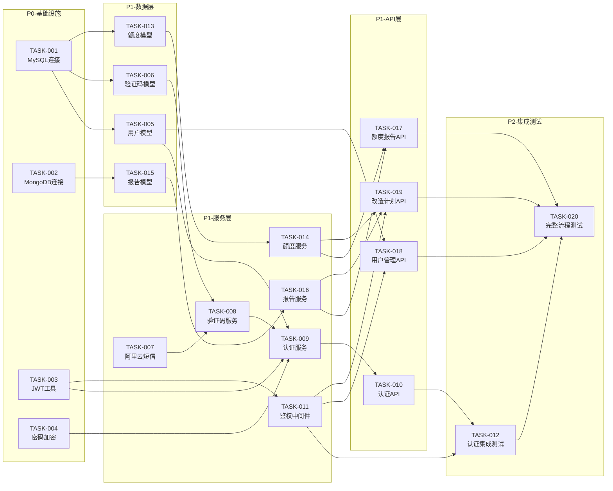

# 开发任务总览

> 基于规划文档: [ITERATION_AUTH_PLAN.md](../ITERATION_AUTH_PLAN.md)
> 生成时间: 2026-03-21

## 代码库现状

### 现有结构
```
backend/
├── src/
│   ├── api/
│   │   ├── routes/         # 已有: track, weather, transport, search, plan
│   │   ├── config.py       # API 配置
│   │   └── utils.py        # API 工具
│   ├── services/           # 业务逻辑
│   ├── schemas/            # Pydantic 数据模型
│   ├── domain/             # 领域编排器
│   └── utils/              # 通用工具
├── test/                   # pytest 测试
│   ├── conftest.py         # pytest 配置和 fixtures
│   ├── api/
│   ├── services/
│   └── integration/
└── main.py                 # FastAPI 入口
```

### 技术栈
- 后端框架: FastAPI
- 数据验证: Pydantic V2
- 测试框架: pytest
- 现有服务: 天气、地图、搜索、LLM、轨迹解析

### 代码风格
- 使用 Pydantic V2 `BaseModel` + `ConfigDict`
- 使用 `Field()` 定义字段约束
- 服务类放在 `src/services/`
- 路由使用 `APIRouter`
- 测试文件放在 `test/` 对应目录

---

## 任务统计

- 总任务数: 20
- P0 任务: 4（基础设施）
- P1 任务: 14（核心功能）
- P2 任务: 2（集成测试）
- 预估总工时: ~13 人天

## 任务列表

### P0 - 基础设施（第 0-0.5 天）

| 编号 | 名称 | 优先级 | 工时 | 前置任务 | 状态 |
|------|------|--------|------|----------|------|
| TASK-001 | MySQL 数据库连接 | P0 | 0.5d | 无 | ⬜ 待开始 |
| TASK-002 | MongoDB 数据库连接 | P0 | 0.5d | 无 | ⬜ 待开始 |
| TASK-003 | JWT 认证工具类 | P0 | 0.5d | 无 | ⬜ 待开始 |
| TASK-004 | 密码加密工具类 | P0 | 0.5d | 无 | ⬜ 待开始 |

### P1 - 核心功能（第 0.5-5 天）

| 编号 | 名称 | 优先级 | 工时 | 前置任务 | 状态 |
|------|------|--------|------|----------|------|
| TASK-005 | 用户数据模型与仓库 | P1 | 1d | TASK-001 | ⬜ 待开始 |
| TASK-006 | 短信验证码模型与仓库 | P1 | 0.5d | TASK-001 | ⬜ 待开始 |
| TASK-007 | 阿里云短信客户端 | P1 | 1d | 无 | ⬜ 待开始 |
| TASK-008 | 短信验证码服务 | P1 | 1d | TASK-006, TASK-007 | ⬜ 待开始 |
| TASK-009 | 认证服务 | P1 | 1.5d | TASK-003, TASK-004, TASK-005, TASK-008 | ⬜ 待开始 |
| TASK-010 | 认证 API 路由 | P1 | 1d | TASK-009 | ⬜ 待开始 |
| TASK-011 | 鉴权中间件 | P1 | 0.5d | TASK-003 | ⬜ 待开始 |
| TASK-013 | 额度数据模型与仓库 | P1 | 0.5d | TASK-001 | ⬜ 待开始 |
| TASK-014 | 额度服务 | P1 | 0.5d | TASK-013 | ⬜ 待开始 |
| TASK-015 | 报告数据模型与仓库 | P1 | 0.5d | TASK-002 | ⬜ 待开始 |
| TASK-016 | 报告服务 | P1 | 0.5d | TASK-015 | ⬜ 待开始 |
| TASK-017 | 额度与报告 API 路由 | P1 | 0.5d | TASK-014, TASK-016 | ⬜ 待开始 |
| TASK-018 | 用户管理 API 路由 | P1 | 0.5d | TASK-005, TASK-011 | ⬜ 待开始 |
| TASK-019 | 改造 generate-plan API | P1 | 0.5d | TASK-011, TASK-014, TASK-016 | ⬜ 待开始 |

### P2 - 集成测试（第 5-6 天）

| 编号 | 名称 | 优先级 | 工时 | 前置任务 | 状态 |
|------|------|--------|------|----------|------|
| TASK-012 | 认证模块集成测试 | P2 | 1d | TASK-010, TASK-011 | ⬜ 待开始 |
| TASK-020 | 完整流程集成测试 | P2 | 1d | TASK-012, TASK-017, TASK-018, TASK-019 | ⬜ 待开始 |

---

## 并行开发计划

### 第一批（可立即开始，4 人并行）

无相互依赖的基础设施任务：

| 任务 | 开发者 | 预计完成 |
|------|--------|----------|
| **TASK-001**: MySQL 数据库连接 | 开发者 A | 第 0.5 天 |
| **TASK-002**: MongoDB 数据库连接 | 开发者 B | 第 0.5 天 |
| **TASK-003**: JWT 认证工具类 | 开发者 C | 第 0.5 天 |
| **TASK-004**: 密码加密工具类 | 开发者 D | 第 0.5 天 |

**里程碑 M1**: 基础设施完成（第 0.5 天）

---

### 第二批（依赖第一批，5 人并行）

| 任务 | 开发者 | 依赖 | 预计完成 |
|------|--------|------|----------|
| **TASK-005**: 用户数据模型与仓库 | 开发者 A | TASK-001 | 第 1.5 天 |
| **TASK-006**: 短信验证码模型与仓库 | 开发者 B | TASK-001 | 第 1 天 |
| **TASK-007**: 阿里云短信客户端 | 开发者 C | 无 | 第 1 天 |
| **TASK-013**: 额度数据模型与仓库 | 开发者 D | TASK-001 | 第 1 天 |
| **TASK-015**: 报告数据模型与仓库 | 开发者 E | TASK-002 | 第 1 天 |

---

### 第三批（依赖第二批，4 人并行）

| 任务 | 开发者 | 依赖 | 预计完成 |
|------|--------|------|----------|
| **TASK-008**: 短信验证码服务 | 开发者 B | TASK-006, TASK-007 | 第 2 天 |
| **TASK-011**: 鉴权中间件 | 开发者 C | TASK-003 | 第 1 天 |
| **TASK-014**: 额度服务 | 开发者 D | TASK-013 | 第 1.5 天 |
| **TASK-016**: 报告服务 | 开发者 E | TASK-015 | 第 1.5 天 |

**里程碑 M2**: 核心模块完成（第 2 天）

---

### 第四批（依赖第三批，串行）

| 任务 | 开发者 | 依赖 | 预计完成 |
|------|--------|------|----------|
| **TASK-009**: 认证服务 | 开发者 A | TASK-003, TASK-004, TASK-005, TASK-008 | 第 3.5 天 |
| **TASK-010**: 认证 API 路由 | 开发者 A | TASK-009 | 第 4.5 天 |

---

### 第五批（API 路由层，3 人并行）

| 任务 | 开发者 | 依赖 | 预计完成 |
|------|--------|------|----------|
| **TASK-017**: 额度与报告 API 路由 | 开发者 D | TASK-014, TASK-016 | 第 2 天 |
| **TASK-018**: 用户管理 API 路由 | 开发者 E | TASK-005, TASK-011 | 第 2 天 |
| **TASK-019**: 改造 generate-plan API | 开发者 C | TASK-011, TASK-014, TASK-016 | 第 2.5 天 |

**里程碑 M3**: API 可用（第 4.5 天）

---

### 第六批（集成测试）

| 任务 | 开发者 | 依赖 | 预计完成 |
|------|--------|------|----------|
| **TASK-012**: 认证模块集成测试 | 开发者 A | TASK-010, TASK-011 | 第 5.5 天 |
| **TASK-020**: 完整流程集成测试 | 开发者 A | TASK-012, TASK-017, TASK-018, TASK-019 | 第 6.5 天 |

**里程碑 M4**: 集成验证完成（第 6.5 天）

---

## 依赖图



---

## 里程碑

| 里程碑 | 包含任务 | 预计完成 | 验收标准 |
|--------|----------|----------|----------|
| M1: 基础设施 | TASK-001 ~ TASK-004 | 第 0.5 天 | 所有基础设施测试通过 |
| M2: 核心模块 | TASK-005 ~ TASK-008, TASK-011, TASK-013 ~ TASK-016 | 第 2 天 | 各模块单元测试通过 |
| M3: API 可用 | TASK-009, TASK-010, TASK-017 ~ TASK-019 | 第 4.5 天 | API 测试通过，接口可用 |
| M4: 集成验证 | TASK-012, TASK-020 | 第 6.5 天 | E2E 测试通过，无回归 |

---

## 开发规范

请遵循项目 `.claude/CLAUDE.md` 中的开发准则：

1. **TDD 优先**: 先写测试，再实现
2. **代码风格**: 通过 ruff 检查
3. **类型安全**: 使用 mypy --strict
4. **契约式编程**: 所有输入输出使用 Pydantic 模型

### 测试命令
```bash
# 运行测试
pytest test/ -v

# 代码检查
ruff check src/

# 类型检查
mypy src/ --strict
```

---

## 注意事项

1. **接口先行**: 每个任务开始前，先确认与其他任务的接口定义
2. **Mock 依赖**: 在依赖任务未完成时，使用 Mock 进行测试
3. **禁止修改**: 不要修改任务边界外的文件，避免冲突
4. **及时同步**: 完成任务后更新任务状态
