# Outdoor Agent Planner — 系统架构 UML 图

> 生成日期: 2026-04-16  
> 分支: worktree-agent-architecture

---

## 1. 系统上下文图 (System Context)

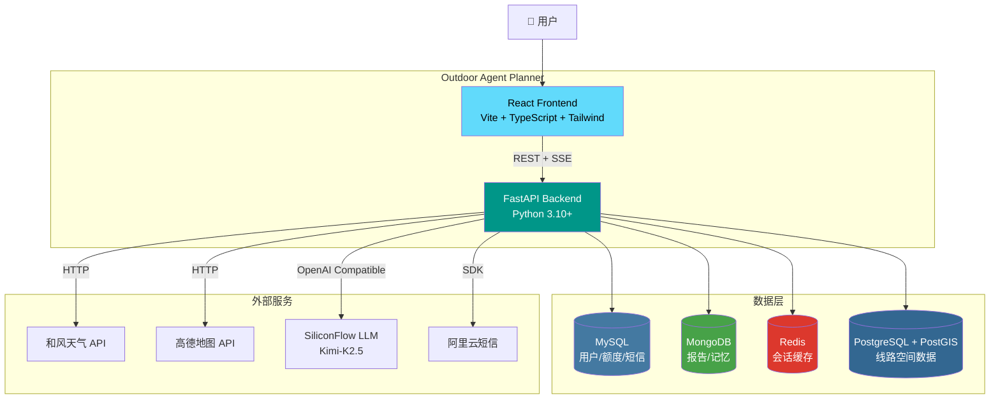

---

## 2. 后端模块依赖图 (Package Diagram)

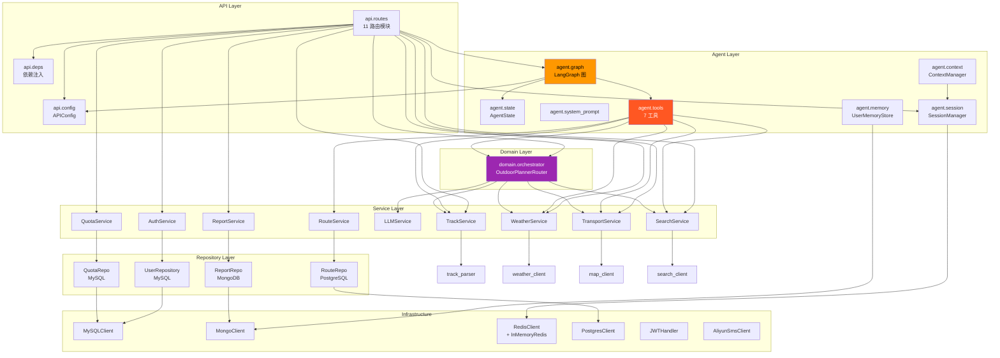

---

## 3. Agent 核心类图 (Class Diagram)

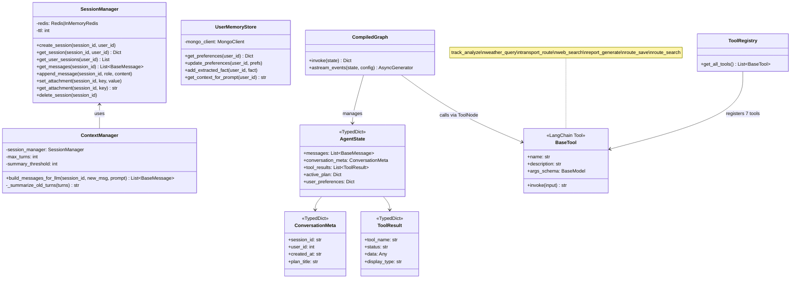

---

## 4. LangGraph 状态机图 (State Diagram)

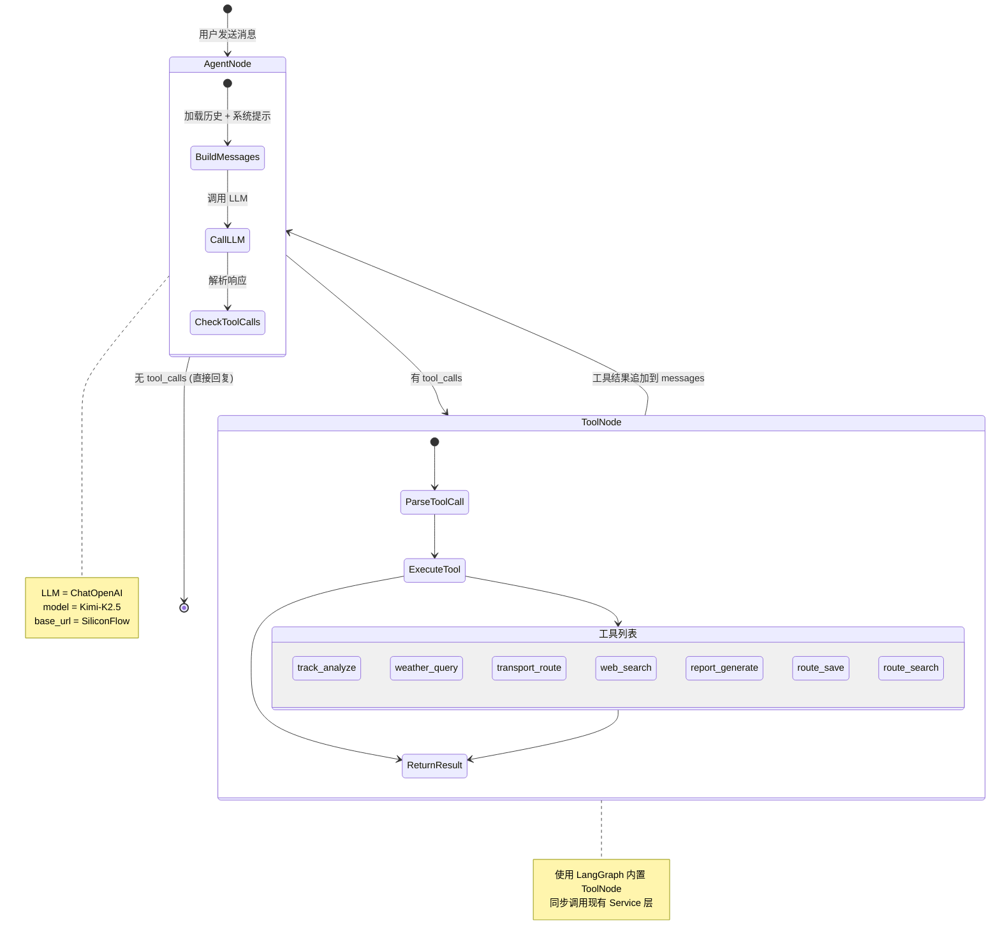

---

## 5. Chat SSE 交互时序图 (Sequence Diagram)

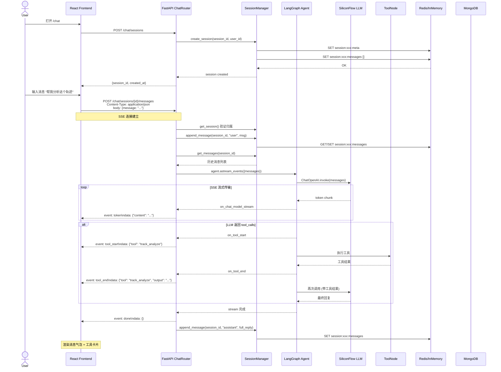

---

## 6. 报告生成编排时序图 (Orchestrator Sequence)

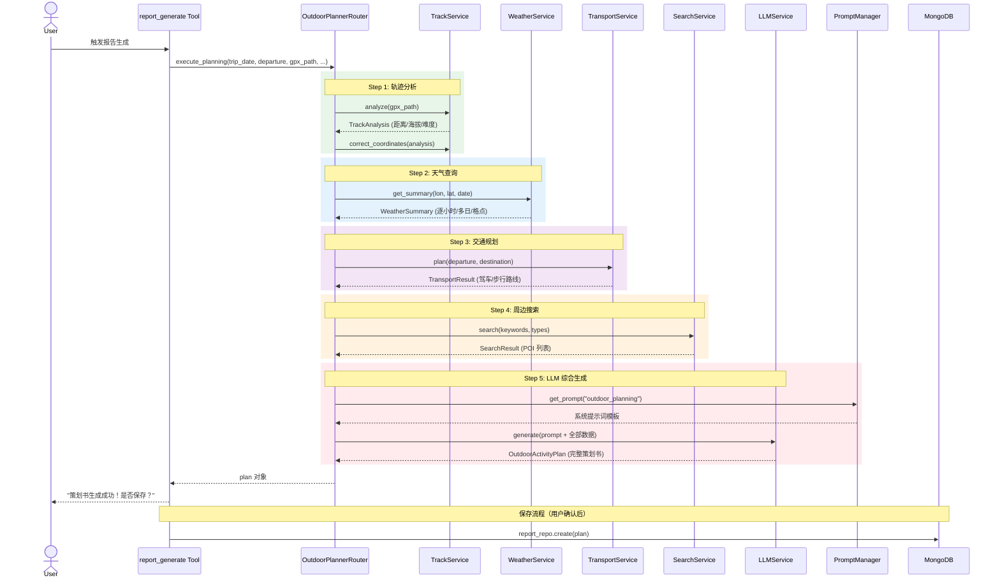

---

## 7. 前端组件树 (Component Diagram)

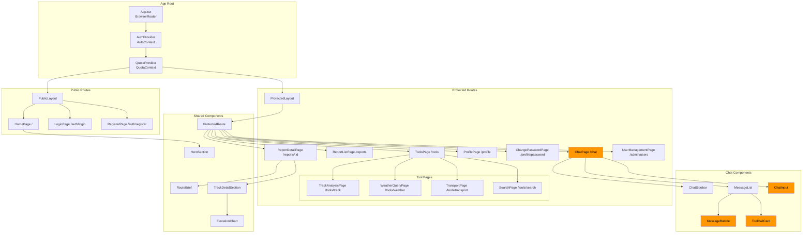

---

## 8. 前端 API 层 (API Client Architecture)

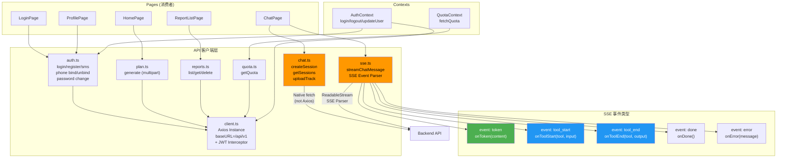

---

## 9. 数据库 Schema 图 (Multi-Database Schema)

```mermaid
erDiagram
    subgraph "MySQL (关系数据)"
        USER {
            int id PK
            string username
            string phone "UK, nullable"
            string password_hash
            string role "user|admin"
            string status "active|disabled"
            datetime created_at
            datetime updated_at
            datetime last_login_at
        }
        QUOTA_USAGE {
            int id PK
            int user_id FK
            date usage_date
            int used_count
            string created_at
        }
        SMS_CODE {
            int id PK
            string phone
            string code
            string purpose
            datetime expires_at
            boolean used
        }
        SMS_SEND_LOG {
            int id PK
            string phone
            string purpose
            string template_id
            boolean success
            datetime created_at
        }
        USER ||--o{ QUOTA_USAGE : "每日额度"
        USER ||--o{ SMS_CODE : "验证码"
    end
    
    subgraph "MongoDB (文档数据)"
        REPORT {
            string _id PK
            int user_id FK
            string plan_name
            string trip_date
            string overall_rating
            object content "完整策划书JSON"
            datetime created_at
            datetime updated_at
        }
        USER_MEMORY {
            string _id PK
            int user_id FK
            object preferences "用户偏好"
            array facts "提取的事实"
            datetime updated_at
        }
    end
    
    subgraph "PostgreSQL + PostGIS (空间数据)"
        ROUTE {
            int id PK
            int user_id FK
            string name
            float start_lon
            float start_lat
            float end_lon
            float end_lat
            float total_distance_km
            float total_ascent_m
            string difficulty
            string region
            datetime created_at
        }
    end
    
    subgraph "Redis (缓存)"
        SESSION_META {
            string key "session:{id}:meta"
            string value "JSON {user_id, created_at}"
            int ttl "86400s"
        }
        SESSION_MESSAGES {
            string key "session:{id}:messages"
            string value "JSON array"
            int ttl "86400s"
        }
        SESSION_ATTACHMENT {
            string key "session:{id}:attachment:{key}"
            string value "string"
            int ttl "86400s"
        }
    end
```

---

## 10. API 端点全景图 (API Endpoint Map)

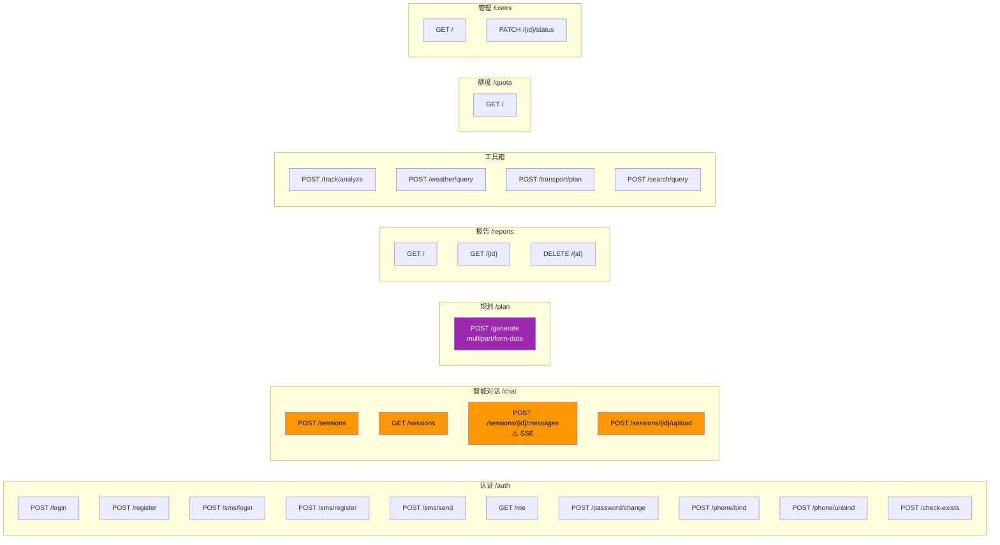

---

## 11. 双路径架构对比 (Before vs After)

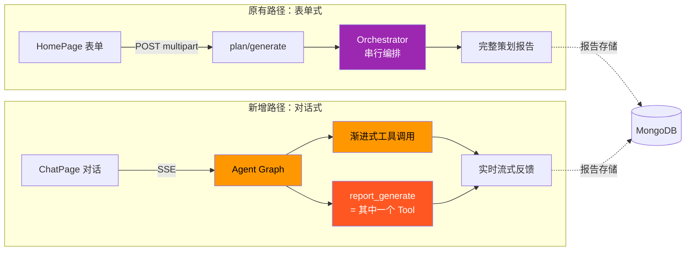

---

## 12. 部署架构图 (Deployment Diagram)

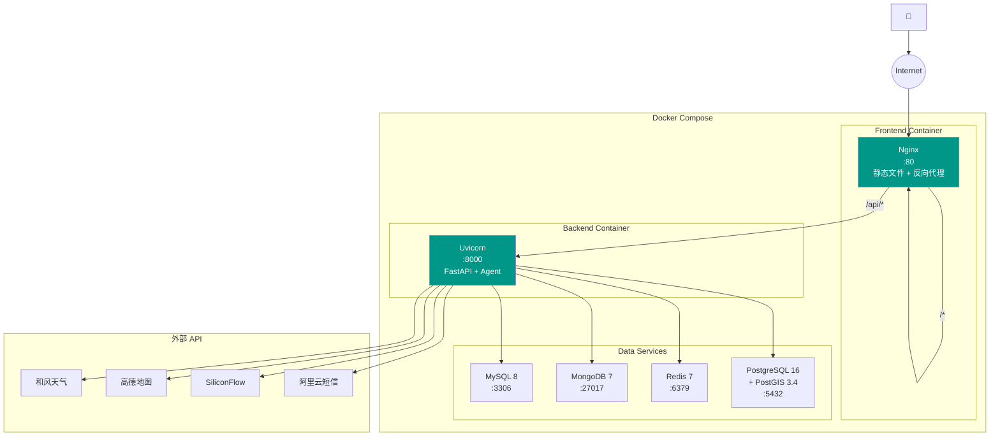
